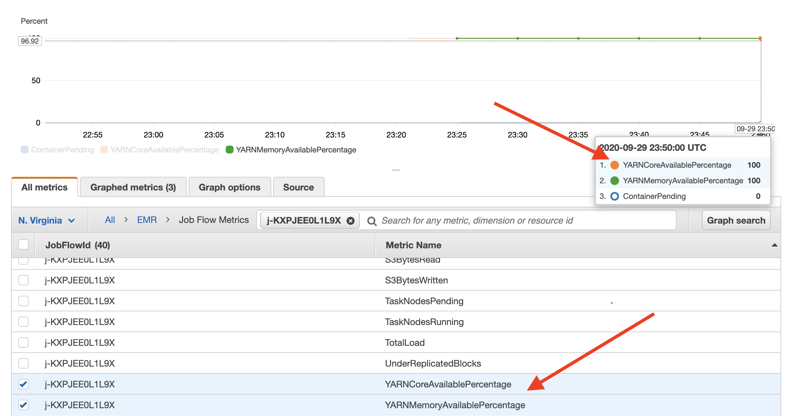
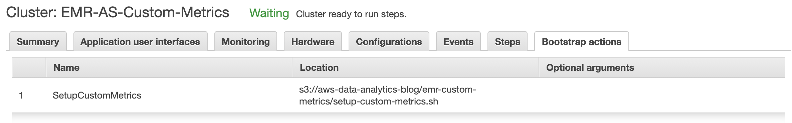

# Amazon EMR Automatic Scaling with Custom Metrics

This writeup is to demonstrate how you can use feed additional metrics from your Amazon EMR cluster and later use
 those metrics to configure [automatic scaling](https://docs.aws.amazon.com/emr/latest/ManagementGuide/emr-automatic-scaling.html). Ideally, for YARN-based application, [EMR Managed Scaling](https://docs.aws.amazon.com/emr/latest/ManagementGuide/emr-managed-scaling.html) can handle majority of the scaling needs. However, if your application doesn't run on YARN or you want to use custom metrics, you can follow this solution to get an idea how you can achieve that.
  
Note: ⚠️ Please use this solution as a reference, do not use this solution in production without testing and
 configuring based on your use case.

## Feeding Additional Metrics to AWS CloudWatch

Amazon EMR Automatic Scaling policy is dependent on CloudWatch metrics, so if you want to  scale out and scale in
core node and task nodes based on a specific value, that value needs to be pushed to CloudWatch. Once, the CloudWatch
 receives that value, then you can write the automatic scaling policy using those values. In this example
 , I'm using YARN Core Available Percentage to configure my autoscaling policy. You can check [Monitor Metrics with CloudWatch](https://docs.aws.amazon.com/emr/latest/ManagementGuide/UsingEMR_ViewingMetrics.html) to see the list of available
 EMR metrics on CloudWatch. I'm using core percentage just for an example, you can use any other value depending on
  your requirement. 
     
I have a bash script [custom-metrics.sh](scripts/custom-metrics.sh) that executes on the EMR cluster master node
 every 30 seconds through a cron job. Inside the script, I'm leveraging [ResourceManager REST
 API’s](https://hadoop.apache.org/docs/r2.8.5/hadoop-yarn/hadoop-yarn-site/ResourceManagerRest.html) to get YARN
  metrics. From all the metrics, I am parsing two different data points **availableVirtualCores** and
   **totalVirtualCores** to calculate the **YARNCoreAvailablePercentage** value. Once I get the value, I use
    [AWS CLI](https://aws.amazon.com/cli/) to publish the value to CloudWatch.

``` bash
#!/bin/bash
set -x -e

REGION=`cat /tmp/aws-region`
HOSTNAME=`cat /tmp/hostname`

RESPONSE=`curl -s $HOSTNAME:8088/ws/v1/cluster/metrics`
CLUSTER_ID=`ruby -e "puts '\`grep jobFlowId /mnt/var/lib/info/job-flow.json\`'.split('\"')[-2]"`

AVAILABLE_CORE=`echo $RESPONSE | jq -r .clusterMetrics.availableVirtualCores`
TOTAL_CORE=`echo $RESPONSE | jq -r .clusterMetrics.totalVirtualCores`
CORE_AVAILABLE_PERCENTAGE=$(echo "scale=2; $AVAILABLE_CORE *100 / $TOTAL_CORE" | bc)

aws cloudwatch put-metric-data --metric-name YARNCoreAvailablePercentage --namespace AWS/ElasticMapReduce --unit Count --value $CORE_AVAILABLE_PERCENTAGE --dimensions JobFlowId=$CLUSTER_ID --region $REGION
```

You can check CloudWatch metrics to find the newly delivered YARNCoreAvailablePercentage metric data. This is the metric
 which will be used in automatic scaling policy to scale the cluster. As you see in the following picture, the new
 metric YARNCoreAvailablePercentage is showing up along with the existing metric YARNMemoryAvailablePercentage.



## Setting up the Custom Metrics
I am using [EMR Bootstrap Action (BA)](https://docs.aws.amazon.com/emr/latest/ManagementGuide/emr-plan-bootstrap.html
) to set up the custom metrics job on the EMR master node. BA executes the script [setup-custom-metrics.sh](scripts/setup-custom-metrics.sh) which downloads the custom-metrics.sh script from Amazon S3 and configure cronjob to
 execute that script in every 30 seconds.



## Using Custom CloudWatch Metrics to configure EMR Automatic Scaling
As of now (EMR 5.30.1), you cannot use or configure custom metrics through EMR console. Only way to use custom
 metrics to configure EMR automatic scaling is to launch the EMR cluster using AWS CLI. Here is a sample AWS CLI to
  launch an EMR cluster with automatic scaling policies using custom metrics.

```bash
aws emr create-cluster --release-label emr-5.30.1 --name 'EMR-AS-Custom-Metrics' \
--applications Name=Hadoop Name=Spark Name=Hive Name=Tez Name=Ganglia \
--bootstrap-actions Path=s3://aws-data-analytics-blog/emr-custom-metrics/setup-custom-metrics.sh,Name=SetupCustomMetrics \
--ec2-attributes '{"KeyName":"<<your-key-name>>","InstanceProfile":"EMR_EC2_DefaultRole","SubnetId":"<<your-subnet-id>>"}' \
--service-role EMR_DefaultRole --auto-scaling-role EMR_AutoScaling_DefaultRole \
--instance-groups file://./scripts/instance-group-config.json
```

I'm using a separate JSON file [instance-group-config.json](scripts/instance-group-config.json) to pass the instance
 groups configuration. Please change the config file based on your requirement. Here is the snippet of the
 configuration file where I'm using the custom metric value - **YARNCoreAvailablePercentage** to configure scale out
 & scale in policy. For scale out, when YARNCoreAvailablePercentage <= 20, it will add 2 nodes to the cluster. For
 scale in, when YARNCoreAvailablePercentage > 75, then it will reduce the cluster size by 2.

```json
"Rules":
[
     {
        "Name":"scale-out-yarn-available-core-percentage",
        "Description":"Scale-out policy",
        "Action":{
           "SimpleScalingPolicyConfiguration":{
              "AdjustmentType":"CHANGE_IN_CAPACITY",
              "ScalingAdjustment":2,
              "CoolDown":300
           }
        },
        "Trigger":{
           "CloudWatchAlarmDefinition":{
              "Dimensions":[
                 {
                    "Key":"JobFlowId",
                    "Value":"${emr.clusterId}"
                 }
              ],
              "EvaluationPeriods":1,
              "Namespace":"AWS/ElasticMapReduce",
              "Period":300,
              "ComparisonOperator":"LESS_THAN_OR_EQUAL",
              "Statistic":"AVERAGE",
              "Threshold":20,
              "Unit":"PERCENT",
              "MetricName":"YARNCoreAvailablePercentage"
           }
        }
     },
     {
        "Name":"scale-in-yarn-available-core-percentage",
        "Description":"Scale-in policy",
        "Action":{
           "SimpleScalingPolicyConfiguration":{
              "AdjustmentType":"CHANGE_IN_CAPACITY",
              "ScalingAdjustment":-2,
              "CoolDown":300
           }
        },
        "Trigger":{
           "CloudWatchAlarmDefinition":{
              "Dimensions":[
                 {
                    "Key":"JobFlowId",
                    "Value":"${emr.clusterId}"
                 }
              ],
              "EvaluationPeriods":1,
              "Namespace":"AWS/ElasticMapReduce",
              "Period":300,
              "ComparisonOperator":"GREATER_THAN",
              "Statistic":"AVERAGE",
              "Threshold":75,
              "Unit":"PERCENT",
              "MetricName":"YARNCoreAvailablePercentage"
           }
        }
     }
]
```
## Demo